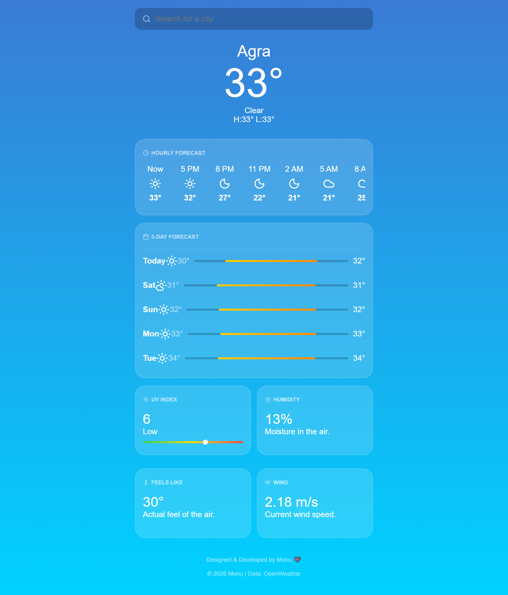
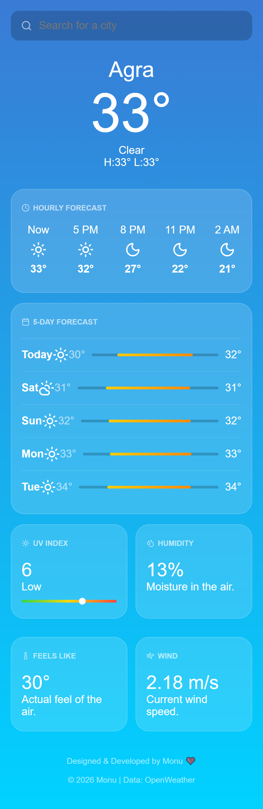

# Weather-lite-App

🌦️ Weather App

A simple and responsive Weather Application that displays real-time weather information for any city.

🚀 Live Demo

👉 View Here: https://weather-app-by-monuu.netlify.app/
Click to See Live Demo

🚀 Features

🔍 Search weather by city name

🌡️ Displays current temperature

💧 Shows humidity

💨 Shows wind speed

📱 Responsive design

⚡ Fast and lightweight

🛠️ Tech Stack

HTML

CSS

JavaScript

Weather API

📸 Screenshot

For mobile ratio-------

📁 Project Structure
weather-app/
│── index.html
│── style.css
│── script.js
│── screenshot.png
│── README.md
👨‍💻 Author

Monu
